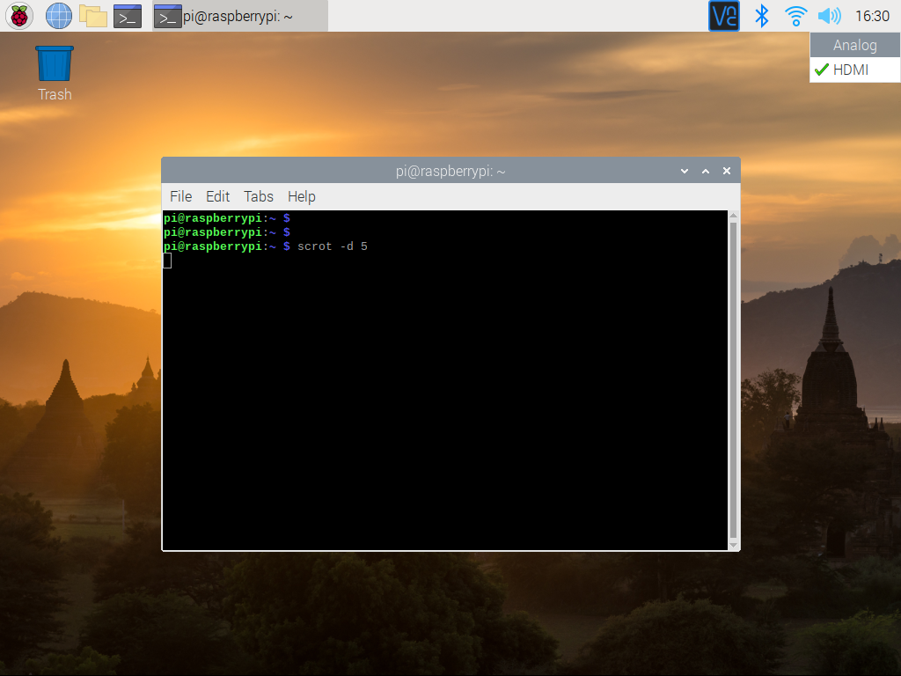

## Getting Start  
.

For order please visit: [DeskPi.com](https://www.deskpi.com/).

## 3.5mm Audio Jack Issues
### When I play music, it can not output from 3.5mm audio jack.

* The audio output is via HDMI port as default in Raspbain OS.
* You can change the output by `right click` the sound icon on task bar and select `AV out` or `Analog` depends on different OS version or `Localization options` 

