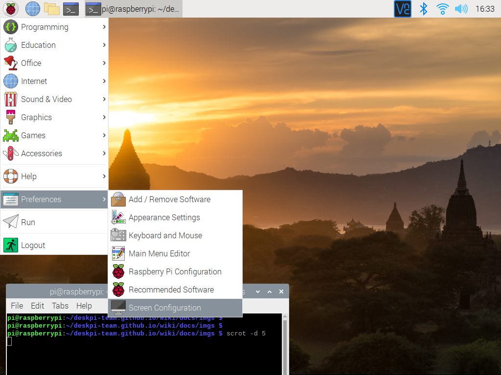

## Getting Start  
.

For order please visit: [DeskPi.com](https://www.deskpi.com/).

## HDMI Port Issues 

### My screen goes to black when I was booting up my deskpi. 

* Reconnect Raspberry Pi with motherboard. 
* Try to shift HDMI cable from HDMI0 to HDMI1 which is beside 3.5mm audio jack and try again.
* Try to setup the resolution:
. 
